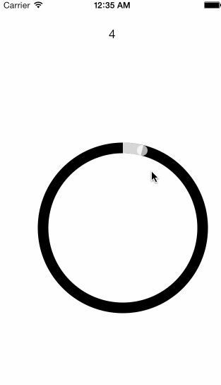

TiCircularSlider
===========================================

Circular slider with many customizations.
Wrapper module for EFCircularSlider.

### Usage

TiCircularProgress is pretty much a ProgressView replacement.

	var TiCircularSlider = require('de.marcelpociot.circularslider');

	var sliderView = TiCircularSlider.createView({
		top: 200,
		left: 50,
		height: 250,
		width: 250,
		lineWidth: 5,
		handleColor: 'red',
		filledColor: '#d7d7d7',
		unfilledColor: '#black'
	});
	sliderView.addEventListener('change',function(e)
	{
		Ti.API.info( "Value is: ", e.value );
	});
	win.add( sliderView );
	

## Options

#### lineWidth

Type: `Float`  
Default: `5`

The circle's line width.

#### minimumValue

Type: `Float`  
Default: `0.0`

#### maximumValue

Type: `Float`  
Default: `100.0`

#### handleColor

Type: `Color`  
Default: `red`

Color for the slider handle.

#### filledColor

Type: `Color`  
Default: `red`

Color for the filled (selected) area of the slider.

#### unfilledColor

Type: `Color`  
Default: `black`

Color for the unfilled (unselected) area of the slider.

## Events

### change
Fired everytime the selection changes.

##### value
Type: `Float`   
The current selected value

ABOUT THE AUTHOR
========================
I'm a web enthusiast located in Germany and in charge of http://www.titaniumcontrols.com

Follow me on twitter: @marcelpociot / @TitaniumCTRLs

